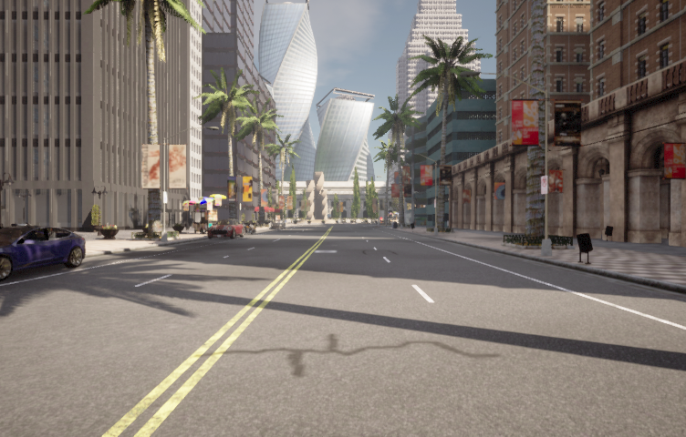
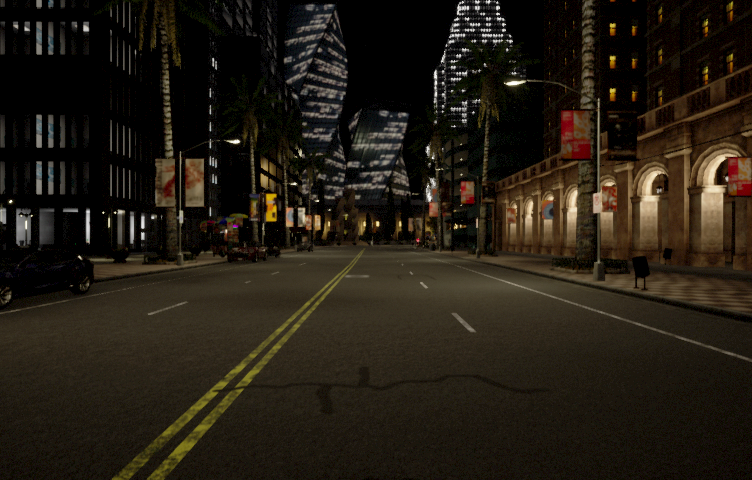
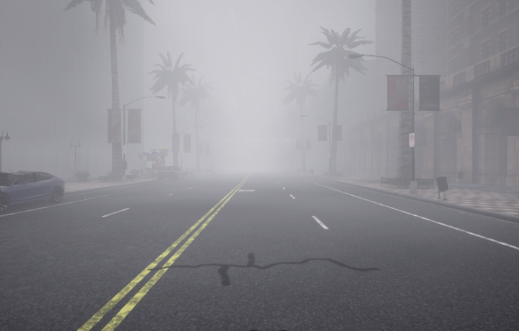
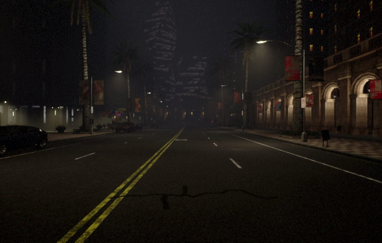
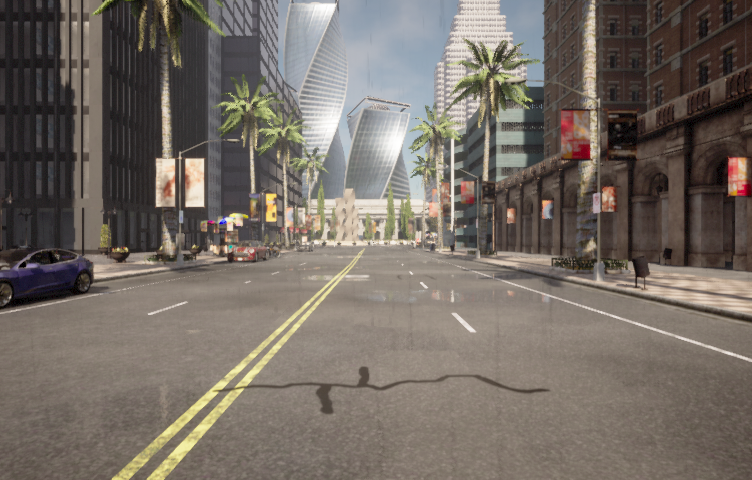
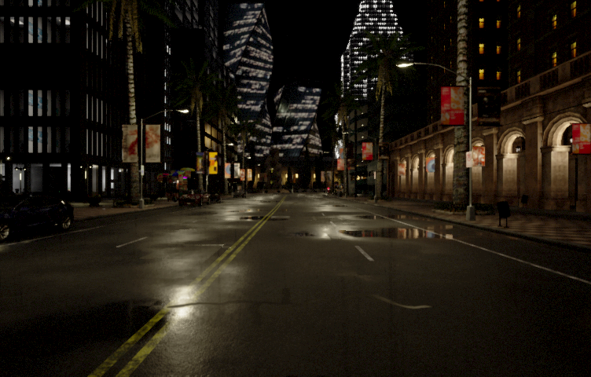
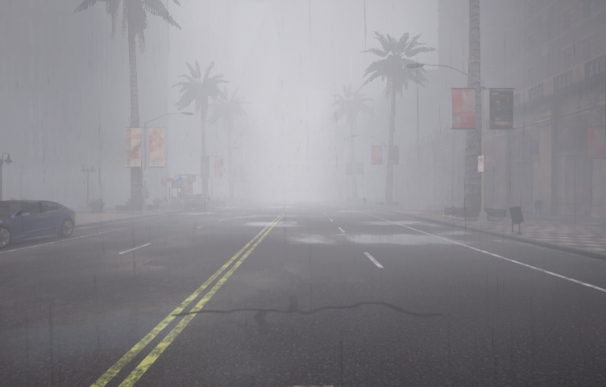
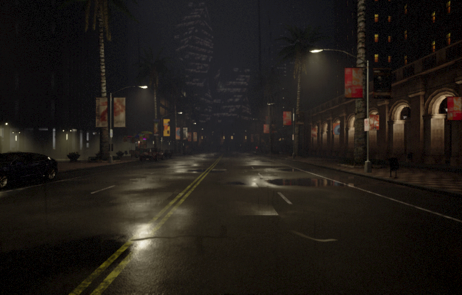
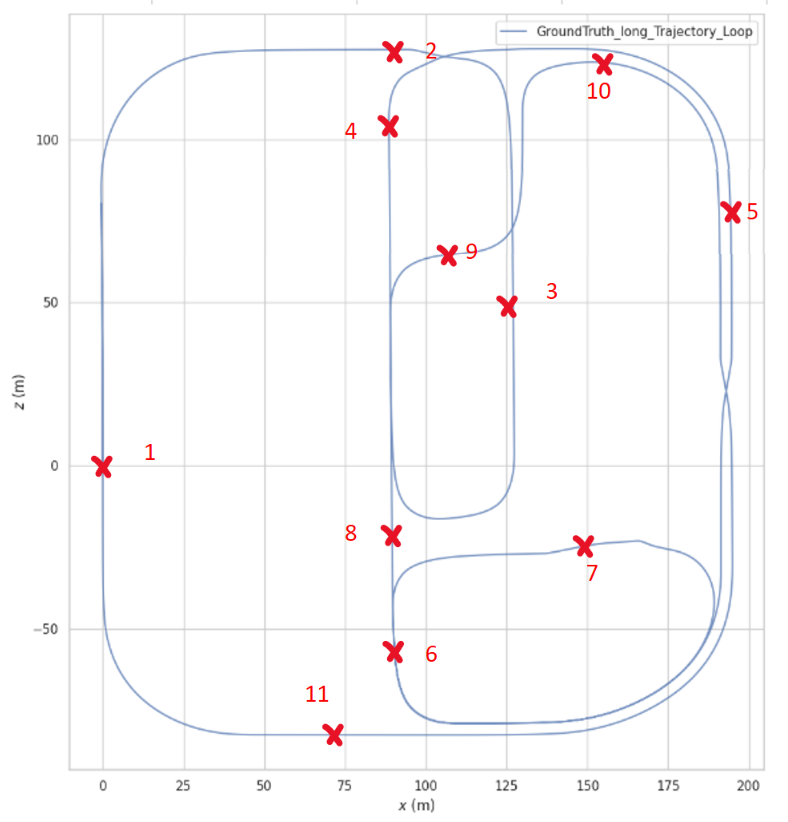
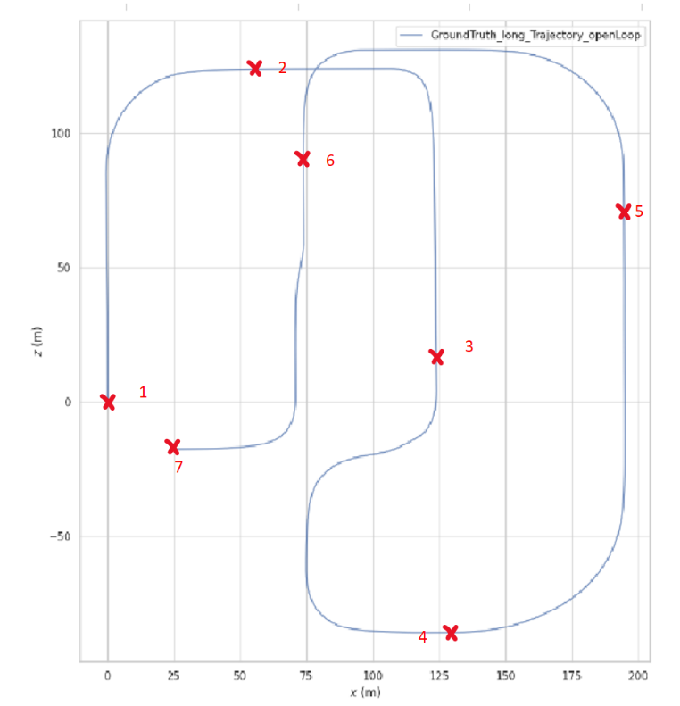

# Optimizing ORB-SLAM for Varied Weather Conditions Using Genetic Algorithms

Master's thesis project — Ain Shams University. This repo covers the full pipeline: generating stereo datasets in [CARLA](https://carla.org/) across 8 weather conditions, running [ORB-SLAM2](https://github.com/raulmur/ORB_SLAM2) stereo on those datasets, and using a genetic algorithm to find optimal ORB-SLAM2 parameters per weather condition.

**Published:** [Optimizing ORB-SLAM2 For Varied Weather Conditions Using Genetic Algorithm](https://iopscience.iop.org/article/10.1088/1742-6596/2811/1/012029) · IOP Journal of Physics: Conference Series

---

## Pipeline

```
CARLA Simulator
    │
    ▼
do_nothing.py ──────────────────────────────────────────────────────────────────
    │  Drives vehicle, records stereo frames (left/right),                      │
    │  IMU data, and ground truth pose (x/y/z + quaternion)                     │
    ▼                                                                            │
ROS Bag Files (rosbag_create.py)                                                 │
    │  Packages stereo + IMU into EuRoC-format bags                             │
    ▼                                                                            │
ORB-SLAM2 Stereo (automateORBSLAM.py)                                           │
    │  Runs SLAM, outputs estimated trajectory (TUM format)                     │
    ▼                                                                            │
Genetic Algorithm (geneticAlgorithm_4params.py)                                 │
    │  Optimizes 4 ORB-SLAM2 parameters:                                        │
    │    · ORBextractor.baseline    (range  20 – 120)                           │
    │    · ORBextractor.nFeatures   (range 600 – 2047)                          │
    │    · ORBextractor.iniThFAST   (range  18 – 50)                            │
    │    · ORBextractor.minThFAST   (range   7 – 50)                            │
    │  Population: 30  ·  Generations: 30  ·  Tournament size: 5               │
    │  Elitism: 3  ·  Mutation rate: 0.1  ·  Crossover rate: 0.8               │
    ▼                                                                            │
parseResults.py ◄───────────────────────────────────────────────────────────────
    │  Evaluates trajectory vs. ground truth using [EVO](https://github.com/michaelgrupp/evo) (RMSE / ATE)
    ▼
Optimized parameters per weather condition + results analysis
```

---

## Dataset

Datasets were generated in **CARLA Town10** across **8 weather conditions** (day/night × normal/rain/fog/rain+fog) and **2 trajectory types**.

### Weather conditions

| | Day | Night |
|---|---|---|
| **Normal** |  |  |
| **Fog (50%)** |  |  |
| **Rain + Puddles** |  |  |
| **Rain + Fog (50%)** |  |  |

### Trajectories

Each weather condition was recorded on two trajectories:

| Closed-loop · 1950 m | Open-loop · 1046 m |
|---|---|
|  |  |

Each dataset folder (e.g. `carla/scripts/dataset/20231014_1/`) contains:

```
left/              # stereo left camera frames (PNG, timestamped filenames)
right/             # stereo right camera frames
GroundTruth.csv    # per-frame: x/y/z, quaternion, velocity, angular velocity
imu_log.csv        # accelerometer + gyroscope readings
Path.txt           # waypoint sequence
weather.txt        # weather preset used
```

> The raw datasets and ROS bag files are not stored in this repository due to size (~3.4 GB per bag). Contact the author if you need access.

---

## Repository Structure

```
masters/
├── carla/
│   └── scripts/
│       ├── do_nothing.py                  # Main CARLA data collection script
│       └── dataset/                       # Generated datasets (images + GT)
│
├── orbslam3_docker/
│   └── orbslam_modifiedFork/
│       ├── ORB_SLAM3/                     # Modified ORB-SLAM3 C++ source
│       └── Datasets/
│           ├── automateORBSLAM.py         # Runs ORB-SLAM2 on bag files
│           ├── parseResults.py            # Trajectory evaluation (EVO / RMSE)
│           ├── changeYamlFileValues.py    # Programmatic YAML parameter editing
│           ├── carlaDatasets/
│           │   └── rosbag_create.py       # CARLA → ROS bag converter
│           └── optimization/GA/
│               └── geneticAlgorithm_4params.py  # Genetic algorithm optimizer
│
├── orbslam2_docker/                       # ORB-SLAM2 baseline (Docker)
├── EnvSetup/                              # CARLA Docker environment setup
├── ros_docker/                            # ROS Melodic Docker setup
```

---

## Getting Started

### 1. Generate a dataset (CARLA)

Requires a running CARLA server (tested on CARLA 0.9.x).

```bash
cd carla/scripts
python do_nothing.py
```

Output is written to `carla/scripts/dataset/<timestamp>/`.

### 2. Convert to ROS bag

```bash
cd orbslam3_docker/orbslam_modifiedFork/Datasets/carlaDatasets
python rosbag_create.py
```

### 3. Run ORB-SLAM2

```bash
cd orbslam3_docker/orbslam_modifiedFork/Datasets
python automateORBSLAM.py
```

### 4. Run the genetic algorithm optimizer

```bash
cd orbslam3_docker/orbslam_modifiedFork/Datasets/optimization/GA
python geneticAlgorithm_4params.py
```

Results (generation, fitness, parameters) are logged to a CSV. Edit `optimizationParameters.txt` to point at your dataset and ground truth file.

### 5. Evaluate results

```bash
cd orbslam3_docker/orbslam_modifiedFork/Datasets
python parseResults.py
```

---

## Publications

- **John Emad**, *Optimizing ORB-SLAM3 For Varied Weather Conditions Using Genetic Algorithm*, IOP Journal of Physics: Conference Series — [journal link](https://iopscience.iop.org/article/10.1088/1742-6596/2811/1/012029)
- Full thesis: [PDF](orbslam3_docker/orbslam_modifiedFork/docs/thesis/Robust_Multi_Weather_Slam.pdf)
